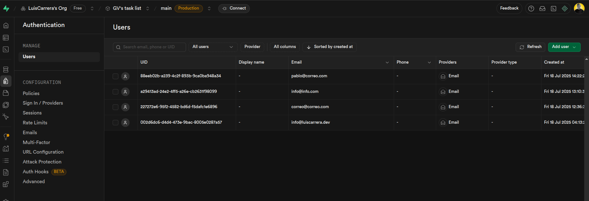

# Aplicación de Tareas - Prueba Técnica para Guatemala Visible

Esta es una aplicación móvil para gestionar una lista de tareas personales, desarrollada como parte del proceso de selección para Guatemala Visible.

El proyecto cumple con todos los requisitos solicitados: permite a los usuarios registrarse, iniciar sesión de forma segura y administrar sus propias tareas, garantizando que la información de cada persona sea privada.


**QR para descargar el APK en Expo**


También se incluye el [APK](task-list-gv.apk) en este repositorio y el [Link del descargable en Expo](https://youtu.be/HtjMB1igO90).

---

## Demostración Visual

Se ha preparado un breve video que muestra la aplicación en funcionamiento, desde el registro de un usuario hasta la gestión completa de sus tareas.

[**Ver Video de Demostración en YouTube**](https://youtu.be/HtjMB1igO90)

A continuación, se muestran capturas de la configuración en Supabase que sustenta la aplicación.

**Supabase panel**


**Supabase panel**


**Supabase panel**


**Supabase panel**



---

## ¿Cómo se usa la Aplicación?

La aplicación está diseñada para ser intuitiva y funcional.

* **Crear una Tarea**: En la pantalla principal, presiona el botón `+` que flota en la parte de abajo. Se abrirá un formulario para que escribas el título, la descripción y la fecha de vencimiento de tu tarea.

* **Marcar como Completada**: Cuando termines una tarea, solo tienes que darle un **toque corto**. El fondo del ítem se pondrá verde y aparecerá un ícono de "check". Si te equivocaste, vuelve a tocarla para desmarcarla.

* **Editar o Eliminar**: Para mantener la interfaz limpia, estas opciones aparecen con una **pulsación larga**. Mantén presionada cualquier tarea por un segundo y aparecerá un menú para que elijas si quieres editarla o eliminarla.

* **Identificar Tareas Vencidas**: Si una tarea no se completó y su fecha de vencimiento ya pasó, su fondo se pondrá automáticamente de color rojo para que sepas que es urgente.

---

## Guía Detallada para Probar la Aplicación

Esta guía explica cómo instalar y ejecutar el proyecto en una computadora para poder probarlo en un teléfono móvil.

### 1. Requisitos Previos por Sistema Operativo

Antes de empezar, es necesario tener instaladas algunas herramientas de desarrollo básicas. Los pasos varían según el sistema operativo de tu computadora.

#### Para Windows:
1.  **Instalar Git**: Descarga e instala Git para Windows desde [git-scm.com](https://git-scm.com/). Esto te dará el comando `git` y una terminal compatible (Git Bash).
2.  **Instalar Node.js**: Descarga e instala la versión LTS desde [nodejs.org](https://nodejs.org/). Esto instalará automáticamente `Node.js` y el gestor de paquetes `npm`.
3.  **Verificar Instalación**: Abre una nueva terminal (CMD, PowerShell o Git Bash) y ejecuta `node -v` y `npm -v` para confirmar que se instalaron correctamente.

#### Para macOS:
1.  **Instalar Homebrew**: Si no lo tienes, Homebrew es un gestor de paquetes muy útil. Instálalo siguiendo las instrucciones en [brew.sh](https://brew.sh/).
2.  **Instalar Herramientas con Homebrew**: Abre una terminal y ejecuta los siguientes comandos:
    ```bash
    brew install git
    brew install node
    ```
3.  **Verificar Instalación**: En la misma terminal, ejecuta `node -v` y `npm -v`.

#### Para Linux (Ubuntu/Debian):
1.  **Instalar Herramientas con APT**: Abre una terminal y ejecuta los siguientes comandos para instalar Git y las herramientas de compilación.
    ```bash
    sudo apt update
    sudo apt install git build-essential
    ```
2.  **Instalar Node.js**: Se recomienda usar `nvm` (Node Version Manager) para gestionar las versiones de Node.js.
    ```bash
    # Descarga e instala nvm
    curl -o- [https://raw.githubusercontent.com/nvm-sh/nvm/v0.39.7/install.sh](https://raw.githubusercontent.com/nvm-sh/nvm/v0.39.7/install.sh) | bash
    # Carga nvm en la sesión actual de la terminal
    export NVM_DIR="$HOME/.nvm"
    [ -s "$NVM_DIR/nvm.sh" ] && \. "$NVM_DIR/nvm.sh"
    # Instala la versión LTS de Node.js
    nvm install --lts
    ```
3.  **Verificar Instalación**: En una nueva terminal, ejecuta `node -v` y `npm -v`.

### 2. Configuración del Proyecto (5 Pasos Clave)

Con los requisitos previos listos, sigue estos pasos en tu terminal.

#### Paso 1: Descargar el Código Fuente
Este comando clona (descarga) una copia del proyecto en tu computadora y te posiciona dentro de la nueva carpeta.
```bash
git clone [URL_DE_TU_REPOSITORIO_EN_GITHUB]
cd [NOMBRE_DE_LA_CARPETA_DEL_PROYECTO]
```

#### Paso 2: Instalar las Dependencias del Proyecto
El proyecto se compone de muchas "piezas" o librerías de código. Este comando las descarga e instala todas automáticamente leyendo el archivo `package.json`.
```bash
npm install
```

#### Paso 3: Conectar la Aplicación a su Base de Datos
La aplicación necesita unas "llaves" para poder hablar con su base de datos en la nube (Supabase).
* Primero, en la carpeta del proyecto, crea un archivo nuevo y nómbralo exactamente **`.env`**.
* Abre ese archivo con un editor de texto.
* Pega el siguiente contenido y reemplaza los textos de ejemplo con tus propias llaves de Supabase. (Las encuentras en la configuración de tu proyecto en la web de Supabase, en la sección "API").

```
EXPO_PUBLIC_SUPABASE_URL=AQUI_VA_LA_URL_DE_TU_PROYECTO
EXPO_PUBLIC_SUPABASE_ANON_KEY=AQUI_VA_TU_CLAVE_ANON_PUBLIC
```

#### Paso 4: Preparar la Estructura en la Base de Datos
Necesitamos decirle a la base de datos cómo organizar la información.
* Ve a la página de tu proyecto en Supabase.
* En el menú lateral, busca la opción **"SQL Editor"**.
* Copia y ejecuta los comandos SQL que se incluyeron en el documento PDF de la prueba técnica. Esto creará la tabla `tareas` y la protegerá para que cada usuario solo pueda ver sus propios datos.

#### Paso 5: Iniciar el Servidor del Proyecto
Este es el último comando en tu computadora. Inicia un servidor local que le enviará la aplicación a tu teléfono.
```bash
npx expo start
```
Al ejecutarlo, la terminal se quedará activa y te mostrará un **código QR grande**. No cierres esta terminal y déjala con el código QR visible.

### 3. Cómo Probar en un Teléfono Móvil

1.  **Conectar a la Misma Red**: Asegúrate de que tu teléfono esté conectado a la **misma red Wi-Fi** que tu computadora. Esto es fundamental para que puedan comunicarse.
2.  **Descargar Expo Go**: Ve a la Play Store (Android) o la App Store (iOS) y descarga la aplicación gratuita llamada **"Expo Go"**.
3.  **Escanear el Código QR**: Abre la aplicación Expo Go en tu teléfono. Utiliza la opción para escanear y apunta la cámara al código QR que está visible en la terminal de tu computadora.

La aplicación se cargará en tu teléfono y podrás registrarte, iniciar sesión y usar todas sus funciones.

---

## Tecnologías Utilizadas

Para construir este proyecto se usó un conjunto de herramientas modernas:

* **Backend**: **Supabase** se encargó de toda la parte del servidor: la base de datos (PostgreSQL), el sistema de usuarios y la seguridad.
* **Aplicación Móvil**: Se construyó con **React Native** y **Expo (SDK 52)**, lo que permite que funcione tanto en Android como en iOS. Se usó **TypeScript** para un código más seguro y libre de errores.
* **Librerías Clave**: Para el manejo de datos se usó **React Query**; para los formularios, **React Hook Form** y **Zod**; y para la navegación, **Expo Router**.
